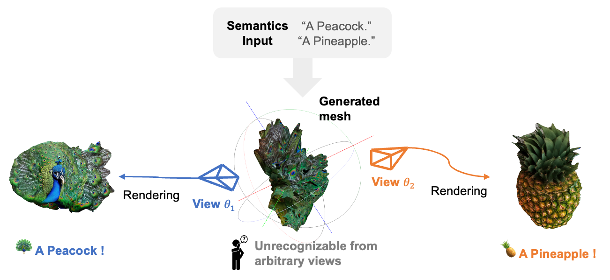

# JanusMesh: Fast, Training-Free Text-Driven 3D Visual Illusions



*JanusMesh is a training-free pipeline that turns two text prompts into a single 3D asset whose semantics read differently from different viewpoints—typically in a few minutes—by fusing dual-branch 3D generation in voxel/SDF space and refining appearance with view-conditioned 2D diffusion on the mesh.*

## Abstract

Creating 3D visual illusions—a single 3D mesh that reveals entirely different semantics from various viewing angles—is a fascinating but tough challenge. Existing optimization-based methods are slow and can produce oversaturated colors. In contrast, naive stitching approaches fail to produce geometrically coherent objects. This results in visible unnatural seams and semantic leaks.

In this paper, we present a fast and training-free framework for generating text-driven 3D visual illusions. Our approach decouples the generation into two stages. First, we propose a cross-space dual-branch denoising process. This process dynamically decodes 3D latents into voxel space for CLIP-guided orientation alignment and Signed Distance Field (SDF) blending, which ensures seamless geometric fusion. Second, we introduce a view-conditioned texture synthesis module that projects and aggregates view-specific 2D diffusion priors onto the fused geometry.

Extensive experiments demonstrate that our method generates highly realistic, dual-semantic 3D illusions in just 3–5 minutes. It significantly outperforms existing methods in geometric integrity, semantic recognizability, and efficiency.

[](./docs/JanusMesh_paper.pdf?raw=1)
[](https://siang1105.github.io/JanusMesh.github.io/)

---

## Environment setup

### 1) Create and activate environment

```bash
cd JanusMesh
conda env create -f environment.yml
conda activate janusmesh
```

### 2) Install CUDA extensions (required)

```bash
bash scripts/setup_extensions.sh
```

`scripts/setup_extensions.sh` installs source-built CUDA extensions (`flash-attn`, `nvdiffrast`, `diff-gaussian-rasterization`, `pytorch3d`) and runs import checks at the end.

### 3) Optional toolchain overrides

Default setup assumes CUDA 11.8 and GCC/G++ 11. If your machine differs, export these before running `setup_extensions.sh`:

```bash
export CUDA_HOME=/usr/local/cuda-11.8
export CC=/usr/bin/gcc-11
export CXX=/usr/bin/g++-11
export TORCH_CUDA_ARCH_LIST=8.9
export MAX_JOBS=4
```

### 4) Quick validation

```bash
python -c "import torch; print(torch.__version__, torch.version.cuda)"
python -c "import nvdiffrast.torch as dr; import pytorch3d; print('extensions ok')"
```

## Usage

### Basic generation

Run from repo root:

```bash
cd JanusMesh
python example_text.py --prompt1 "A Sofa" --prompt2 "Open Book" --case 2 
```

### Arguments

- **`--case 1` or `--case 2`**: direct generation with fixed voxel split.
- **`--case 3`**: CLIP pose search first, then generation.

### Guidance and blending options

- **`--guidance`** has 3 modes:
  - `false` (default): no guidance.
  - `noise_guidance`: guidance in noise space.
  - `space_control`: guidance in space-control mode.
- **`--t0_idx_value`** controls guidance strength for `space_control`; larger value means stronger guidance.
- **`--guided_structure_weight`** controls guidance strength for `noise_guidance`; larger value means stronger guidance.
- **`--blend_strategy`** controls how the two objects are blended. We strongly recommend `sdf_avg`.

### Output

Results are written under `outputs/` with timestamped folders (meshes, renders, and intermediate artifacts).

### Model download

Model weights are loaded from Hugging Face (`microsoft/TRELLIS-text-xlarge`). Ensure network access or a valid local cache.

### Common install issue

If `conda env create -f environment.yml` stalls at `Solving environment` for a long time, stop it and try:

```bash
conda install -n base -c conda-forge mamba -y
mamba env create -f environment.yml
```

